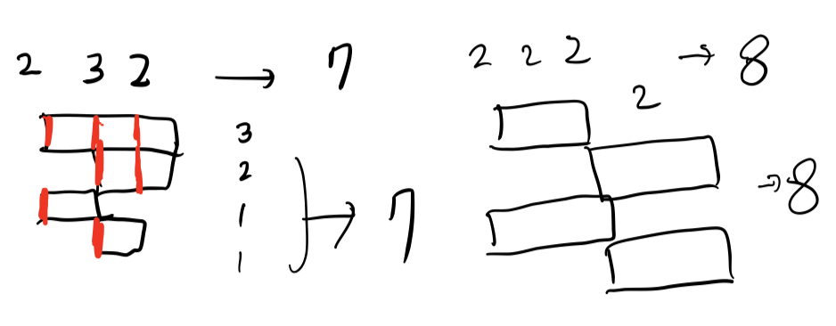
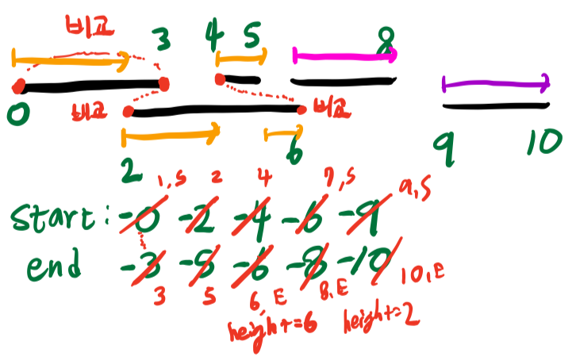

# 문제해결기법 2주차 보고서

## Author
20160385 오진영 (sheogorath0213@kaist.ac.kr; github.com/EEngblo)

--------------------------
## Overview

2018년 가을학기 CS202: 문제해결기법 수업의 2-3주차 문제들에 대한 풀이와 그 보고서이다.
	
---------------------

## 문제 2 [apple]

### **접근 전략**

직관적으로 생각했을 때, 가장 쉽게 생각할 수 있는 알고리즘은 n개의 사과들에 대해서 각각 그 사과들로부터 m개씩 앞으로의 사과들의 당도를 조사하여 그 최솟값을 돌려주는 것으로, **$O(nm)$** 의 시간복잡도를 갖게 된다. 하지만, 이렇게 쉬운 문제를 냈을 리가 없고, 수업에서 다양한 자료구조들을 배웠기 때문에 이것을 이용하여 풀이를 찾고자 시도했다.

우선, 이 문제에 대한 해법은 적어도 모든 사과들에 대해서 한 번은 조사를 해야하기 때문에 적어도 **$O(n)$** 의 시간복잡도를 갖게 된다. 하지만, 이것은 각각의 사과를 조사할 때 다음 m개의 사과들의 당도를 상수 시간 안에 구할 수 있어야 하기 때문에 불가능하다.

따라서, 최적의 알고리즘의 시간복잡도는 **$O(n log m)$** 혹은 **$O(n log n)$** 이 될 것이라는 직관에 기반하여 문제를 풀고자 했고, 로그 시간 내에 최저값을 찾기 위해서는 minHeap이나 binary search tree 구조가 필요할 것이라는 직관에 이르렀다.

minHeap의 경우 최솟값을 바로 찾을 수는 있으나, 원하는 노드를 삭제하는 것이 오래 걸리고 번거롭기 때문에, 지난 수업 시간에 소개되었던 1번 문제의 풀이에 기반하여 map을 이용한 binary search tree를 활용한 알고리즘을 생각했고, 문제를 해결할 수 있었다.

### **알고리즘**

> `m == 1`

이 경우에는 사과를 한 개만 주므로 그냥 입력받은 당도를 즉시 출력하면 된다.

> `m == n`

전체 사과의 개수만큼 주는 것이므로 전체의 최소값을 구한 후 그것을 n번 출력하면 된다.

> 일반 케이스

내가 이 문제를 풀기 위해 사용한 자료구조는 아래와 같다.

```c++
// key: 당도, value: 관심 대상 queue에 있는 사과 중 그 당도의 사과의 수
map<int, int> apples;
map<int, int>::iterator minSweet; // 위의 map BST의 최소값을 가리킬 포인터

queue<int> que; // 관심의 대상이 되는 m개의 사과의 당도에 대한 queue
int* moreApples; // 원형 큐를 구현하기 위해 할당할 동적 배열
```

사과를 원형으로 배열하기 때문에, 원형 자료구조가 필요하다. 간단하게 이를 흉내내기 위하여, m의 크기를 갖는 배열에 처음 m개의 사과의 당도를 집어넣어 그 사과를 n개의 사과를 처리한 후 이어서 더 차리하도록 했다. 이 배열이 `moreApples`이고, 이 작업과 동시에 m개를 먼저 `que`와 `apples` Binary search tree에 넣어 두었다.

이후, n번 동안 아래의 작업을 반복한다.

1. 맵은 binary seach tree이고 그 최소값을 가리키는 `begin()`에 대한 접근은 상수 시간 안에 가능하다. 따라서 `apples.begin()` 부터 시작해서 그 값이 1 이상인 (큐에 하나 이상 들어가 있는) 가장 작은 당도를 찾는다. 이 과정에서 값이 0인 노드는 (큐에 들어가 있는(지금 사과로부터 m개 이내의) 사과 중에는 그 당도가 없다는 것이므로) 삭제한다.
2. 그 당도를 출력한다!
3. `que.front()`의 당도에 해당하는 `apples` 맵의 value를 감소시킨다; (`apples[que.front()]--`). 왜냐하면 큐에서 삭제될 사과는 방금 관찰한 사과이기 때문에 다음 번 관찰에서 이 사과는 필요가 없게 되기 때문이다!
4. 큐에서 사과 하나를 빼고, 새로운 사과의 당도를 큐와 맵에 push한다.


### **복잡도 분석**

위의 알고리즘에서, 큐에 push, pop하는 것, 그리고 `map.begin()`은 상수 시간 안에 이루어지므로, map에 노드를 삭제, 추가, 업데이트하는 것이 가장 많은 시간을 소비한다. 각각은 **$O(log n)$** 의 시간 복잡도를 갖고, 이 작업이 **n** 번 일어나므로 시간복잡도는

**$O(n log n)$**

이다.

---------------------

## 문제 3 [shade]

### **접근 전략**
처음에 이 문제를 봤을 때, 어떻게 해결해야 할 지에 대해서 굉장히 난해했다. 각 사각형들 사이의 위치관계를 모르는 상태에서, 어떻게 중첩과 포함 관계를 해결해야 순수한 넓이를 구할 수 있을지 막막했다. 그래서 생각한 것은,

> 만점을 받는 것을 포기하고 느리더라도 일단 부분 점수를 받을 수 있는 알고리즘을 생각해 보자.
 
이다. 따라서 간단해 보이는 예제를 먼저 해결해 보고자 하였고, 먼저 컴퓨터가 어떻게 예제를 받아들여야 할지를 그림을 그려서 확인해 보았다.


위의 그림과 같은 모양을 우리가 계산한다면 전체 넓이인 100을 구한 후, 가운데 64만큼을 빼서 36을 얻겠지만, 기계적으로 단순하게 생각했을 때, `x = 0` 부터 `x++`해 가며 그 `x`에 해당하는 사각형을 구하는 것이 가장 단순해 보였다. 즉, 위의 예제의 경우

1. x = [0, 1) 에서 높이 10 => 넓이 10
2. x = [1, 9) 에서 높이 1+1 => 넓이 16
3. x = [9, 10) 에서 높이 10 => 넓이 10

가 될 것이다. 이 알고리즘을 위해서는

1. 각 x좌표에 존재하게 될 사각형 식별하기
2. 각 x좌표에 존재하는 사각형들의 누적된 높이 구하기
3. 높이를 이용하여 넓이를 구하고 누적하기

의 세 과정이 필요했고, 이 방법에 대해 생각해 보게 되었다.


### **알고리즘 및 복잡도 분석**

1. 각 x좌표에 존재하게 될 사각형 식별하기

사각형들이 임의의 순서로 입력이 되기 때문에, 먼저 정렬이 필요할 것이라고 생각했다. 또, 우리가 관심을 가지는 것은 '각 x좌표에서 어떤 사각형들이 존재할 것인가?' 이기 때문에 `x == x1`일 때 어떤 자료구조에 그 사각형을 넣고, `x == x2`일 때 그 사각형을 자료구조에서 빼야 할 것이라고 생각했다. 이것을 가장 빠른 시간 내에 할 수 있는 자료구조는 역시 tree 형태일 것이고, 그중 적절한 것을 생각하다 `multimap`을 이용하기로 하였다. 구체적 알고리즘은 아래와 같다.

> 1. 입력 받은 사각형들을 각각 `x1`과 `x2` 좌표에 따라 오름차순으로 정렬한다.
> 2. `for i in range( max( x2Vector ) )` 꼴로 x좌표들에 대해 loop를 돌며 현재 x좌표(`=i`)에서부터 시작하는 사각형(`i == x1`) 들을 multimap에 아래의 꼴로 넣는다
> >key := `x2`, value := `(y1, y2)`
> 3. 한편, x좌표(`=i`)에서 끝나는 사각형(`i == x2`) 이 있다면 multimap에서 삭제한다. multimap에 넣을 때 `key`를 끝나는 점으로 했기 때문에 쉽고 빠르게 제거할 수 있다.

위의 방법을 통해서, 각각의 x좌표에 대해 어떤 사각형들이 존재하게 되는지 multimap의 모든 노드를 참조하여 얻을 수 있다. 위의 작업이 완료된 후에는 높이를 구해야 하고 높이를 구하는 것 역시 많은 시간이 소비될 것이므로 더 최적화하기 위하여, 존재하는 사각형의 변화가 일어나는 구간들에 대해서만 관심을 갖도록 한다. 이를 구현하기 위해서, `x1`과 `x2`의 구분 없이 모든 x좌표들의 vector를 만든 후 정렬해서 사각형의 변화가 일어나는 x좌표만을 취한 뒤, 이 좌표들에 대해서만 위의 과정을 하도록 했다.

이 때, 정렬에 **$O(n log n)$** 이 소요되고, multimap에 추가하고 삭제하는 것은 각각 O(log n)의 시간이 소요되는데 이 과정이 n번 일어나므로 **$O(n log n)$** 의 시간복잡도를 갖게 된다.

2. 높이를 이용하여 넓이를 구하고 누적하기

높이를 구하는 것은 복잡하기 때문에 나중에 생각하기로 하고, 높이를 이용해서 넓이를 구하고 누적하는 과정에 대해 생각했다. 먼저, 다양한 경우들을 직접 그려보고 어떻게 높이를 이용해서 넓이를 구할지 생각했다.



위 그림에서, `x == 0`일때 빨간 선의 길이 2는 [0, 1)구간의 넓이 2를 span하고 `x == 1`일때의 길이 3은 [0, 1)구간의 넓이 3을 span한다. 이처럼, 각각의 `x == i`일 때, `i == x2`인 사각형들을 제거하고 난 후의 높이 `height`에 대해, 사각형이 추가되거나 삭제되는 다음 번 `x`까지의 거리 `deltaX`와 높이의 곱인 `height * deltaX` 만큼의 넓이를 누적하면 된다는 것을 알 수 있었다.

이 연산은 `height`가 올바르게 구해졌다면 **$O(n)$** 안에 이루어질 수 있다.

3. 각 x좌표에 존재하는 사각형들의 높이 구하기

결국 이 과정이 이 문제를 해결하는 데에 있어서 가장 중요한 부분이라고 할 수 있겠다. 이 과정이 **$O(n log n)$** 안에 가능하다면 전체 시간복잡도는 **$O(n log n)$** 이 될 수 있겠지만, 그보다 나쁘다면 그 값이 전체 시간복잡도가 될 것이기 때문이다.

사실 **코드로 구현한 알고리즘보다 복잡한 알고리즘을 생각하였다**. x좌표의 변화에 따라서 사각형이 추가되고 삭제될 때의 높이 변화를 각각 **$O(log n)$** 안에 구해서 전체 시간복잡도를 **$O(n log n)$** 으로 만들기 위해 현재 활성화된 사각형들의 y좌표의 시작과 종료 지점을 binary search tree로 구현하는데, 구체적으로는 두 단계로 나눈다. 내가 처음 제출한 코드에는 이것을 위한 자료구조가 남아 있다.

```c++
typedef struct _line {
    int y1;
    int y2;
    int length;
} Line;

typedef struct _disjointLine {
    int y1;
    int y2;
    int length;
    multimap<int, Line> lines;
} DisjointLine;
```

`DisjointLine`은 각각의 disjoint한 선분들을 담게 된다. 예를 들어서, (y1, y2)꼴로 나타냈을 때 (1, 5), (2, 6)의 사각형이 있다면 `DisjointLine`에는 (1, 6)이 들어가게 되고 `multimap<int, Lint> lines`에 이 선분을 구성하는 각각의 사각형들에 대한 정보가 담기게 된다.

새로운 사각형을 추가할 때는 그 사각형이 들어갈 만한 `DisjointLine`을 binary search를 통해 찾고, 그 안에 넣고 그 안의 `map`에도 한번 더 넣어야 한다. 이렇게 하게 되면 다른 `DisjointLine`은 건드리지 않게 되고, 삽입이 약 **$O((log n)^2)$** 가 걸리게 된다. 하지만 만약 새로 추가되는 사각형이 두 `DisjointLine`을 이어버리게 되면 문제가 복잡해진다.

새로운 사각형을 삭제할 때도 `map` 구조의 특성을 활용해서 key로 바로 접근해서 삭제하면 된다. 하지만 이 때도 `DisjointLine`이 나뉘게 되면 나누어 주어야 한다.

이러한 과정이 매우 복잡할 것이라고 생각해서, 먼저 간단한 알고리즘을 통해서 앞서 짠 알고리즘이 잘 동작하는지를 보고자 했다. 그래서 매우 단순하고 간단한 알고리즘을 먼저 생각하고 구현했는데, 그 알고리즘만으로 한번에 100점이 떠서 당황했다. 위의 알고리즘을 구현해 보고 또 더 좋은 알고리즘을 생각해 보고 싶지만, 다른 과목들의 과제들도 많기 때문에 일단은 여기에서 멈추고 간단한 알고리즘으로 구현해서 제출했다. 간단한 알고리즘은 아래와 같다.

> 1. 현재 x값에서 존재하는 사각형들에 대해서, `y1`과 `y2`들을 각각 `yStart`와 `yEnd`, 두 개의 *min Heap*에 넣는다. (오름차순 정렬)
> 2. 두 *heap*이 모두 빌 때 까지 아래 코드를 반복한다. `linecnt`와 `newLinecnt`는 0으로 초기화되어 있다. 주의할 점은 *max Heap*으로 *min Heap*을 흉내내기 위해 모든 y값들은 음수로 바뀌어 들어가 있다.
> ```c++
> if(!yStart.empty() && yStart.top() > yEnd.top()){
>   // 현재 사각형의 끝보다 다음 사각형의 시작이 가깝다면
>   newLinecnt++; // 중첩 정도를 높인다.
>
>   if (linecnt == 0) // 원래 중첩이 하나도 안 되어 있었다면
>       fragmentStart = yStart.top(); // 이 사각형의 시작이 이 선분의 시작이다
>   yStart.pop();
> } else {
>   // 현재 사각형의 끝이 다음 사각형의 시작보다 가깝다면
>   newLinecnt--; // 중첩 정도를 낮춘다
>   if (newLinecnt == 0) // 이제 하나도 중첩이 안 되어있다면
>       height += fragmentStart - yEnd.top(); // disjoint한 선분은 여기가 끝이고 그 길이는 이 점과 선분의 시작(fragmentStart) 사이의 차이다.
>   yEnd.pop();
> }
> linecnt = newLinecnt;
> ``` 
> 
> 
> 위의 그림은 알고리즘을 보기 쉽게 표현한 것이다. 초록색은 좌표를 의미하고, 빨간색은 순서대로 일어나는 이벤트를 나타낸다. 이 과정을 통해서 길이 9를 얻어낼 수 있다.

처음 설계보다 알고리즘이 훨씬 단순하고 느려 보이기 때문에 이 알고리즘이 100점을 맞을 수 있을 것이라고는 생각하지 못했다. 만약 다른 과제로 바쁘지 않았더라면 처음 설계를 구현했겠지만 그럴 시간이 없어 구현하지 못해 아쉽다. 다른 누군가가 내 풀이를 완성했기를 바란다.

나의 이 풀이는 대략적으로 각각의 `x == i` 지점마다 모든 사각형들을 *heap*에 넣고 빼기 때문에 **$O(n log n)$** 이 소요된다. 생각해 볼 수 있는 worst case 중 하나는 n개의 사각형 1~n 이 모두 x = 0에서 시작하여 사각형 번호 k에 대해 y = k까지 있는 경우이다. 이 경우에는 k + 1번 위의 알고리즘이 수행되게 되고, 각각 [n, 1] 에 해당하는 수만큼의 노드들을 *heap*에 추가했다가 빼야 한다. 결국 n(n + 1)/2번 연산이 일어나게 되고, 시간복잡도는 **$O(n^2 (log n)^2)$** 로 근사할 수 있다. 어떻게 이렇게 느린 알고리즘이 100점이 나왔는지 궁금하지만, 조교분들과 교수님들의 따뜻한 배려 덕분이라고 생각한다. 어쩌면 나의 복잡도 계산이 틀렸을 가능성도 있다. 어쨌던 다른 누군가가 나의 원래 풀이를 구현했기를 바란다.